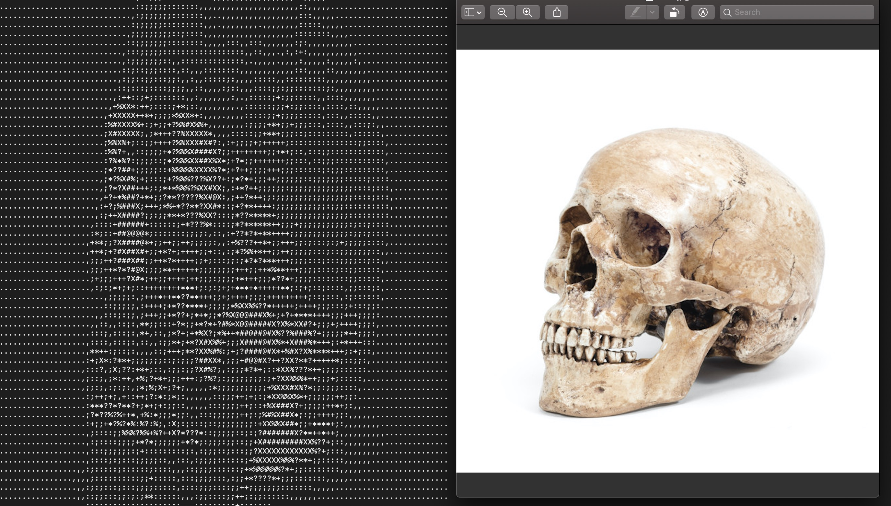

# ACII_Art
Enter the relative path of the image you wish to transform into ACII art.
A text file holding the masterpiece,  called "ascii_image.txt", will be saved in the same directory as the program.

  

Process:
1. Image is first resized to have a width of 100 (keeps its ratio).
2. New image is converted into grayscale.
3. Pixels are converted to ASCII characters; (@, #, X, %, ?, *, +, ;, :, ,, .) in decreasing order of intensity.
4. ASCII image is returned and saved to a text file named "ascii_image.txt".

Used the Python Imaging Library (PIL) to develop the images. 
